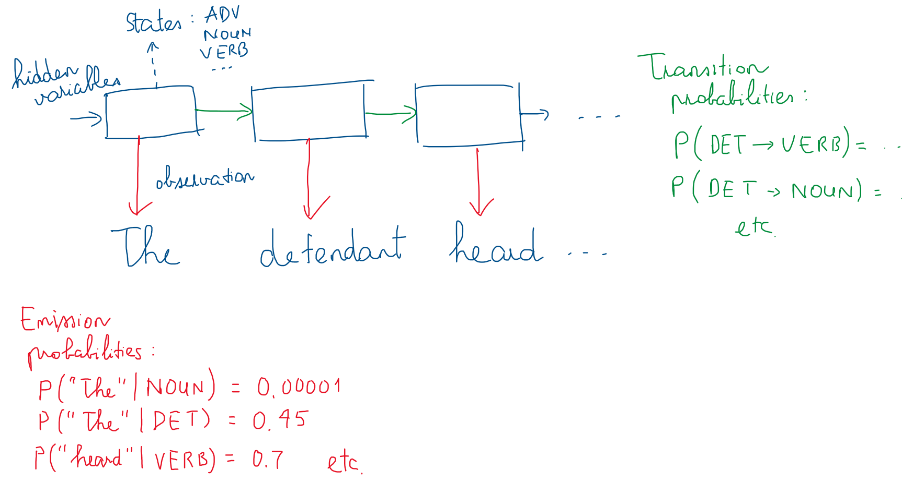

# Experiment: Part-of-speech Tagging with Hidden Markov Model

In this experiment, I implemented a Hidden Markov Model for tag each word in a sentence with the correct type (noun, adjective, adverb, etc.) - based on the instructions and starting code from an assignment in Udacity's Artificial Intelligence course.

The program can be executed by running cells sequentially in this notebook: [T_part_of_speech_tagger.ipynb](T_part_of_speech_tagger.ipynb)

The dataset used in the program is a copy of the Brown corpus that has already been pre-processed to only include the universal tagset (containing 12 tags) - as provided in the Udacity starter files.

I have summarized the algorithm in the diagram below. The tag of each word in a sentence is the **hidden variables**, and these variables can be one of 12 states (corresponding to 12 tags). The actual words in a sentence are the **observations**. The emission and transition distributions are determined by counting the frequency of corresponding transitions or word-tag pairs in the training corpus.

## Comparison with naive tagger

For comparison, a naive part-of-speech tagger based on simple frequency has also been implemented, called `MFCTagger` - each word's predicted tag is just the tag that's most frequently assigned to that word in the entire training corpus.

The naive `MFCTagger`'s accuracy is 93-95% on both training and testing corpus. The word tagger based on the Hidden Markov Model score about 95-96% on training and testing corpus - so not much improvement.

My guess is that word types in general already follow a strict pattern (for example, in English, the majority of the times, adjective goes before noun, and determinant such as 'the' goes before noun, etc.). And majority of words would be one type only in most common text (only adjective/noun/verb), much more often than other variations that they might have. 

Thus, the prior probabilities, determined by simple counting, are enough to determine word type. Hidden Markov Model does not seem to add much inference power to the problem of tagging word types.

_**NOTE**: The initial instruction was to use the `pomegranate` library and its `viterbi()` function on an HMM model in order to compute the most likely sequence of tags. But recent versions of `pomegranate` library removed `viterbi()`, so I created the wrapper class `MyHMM` in order to implement my own Viterbi Trellis algorithm. Because this part-of-speech tagger only relied on Viterbi algorithm, the program actually only used `pomegranate` to hold HMM parameters, such as emission distributions and transition distributions, and not for any computation._

## Hidden Markov Model for part-of-speech tagging

